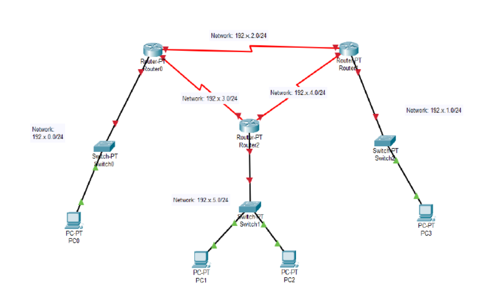

markdown
Copy
# Static Routing Configuration in Cisco Packet Tracer

  
*Figure 1: Network topology for static routing lab*

## **Objective**
Configure static routing on all routers to enable communication between all PCs in the network.

## **Network Addressing**
- **Router-P (Router0):**
  - Interface 1: `192.x.2.1/24` (Connected to Switch0)
  - Interface 2: `192.x.3.1/24` (Connected to Router-PT)
  
- **Router-PT (Router0):**
  - Interface 1: `192.x.3.2/24` (Connected to Router-P)
  - Interface 2: `192.x.4.1/24` (Connected to Switch1)

- **PCs:**
  - PC0: `192.x.1.2/24` (Gateway: `192.x.1.1`)
  - PC1: `192.x.5.2/24` (Gateway: `192.x.5.1`)
  - PC2: `192.x.2.2/24` (Gateway: `192.x.2.1`)

---
